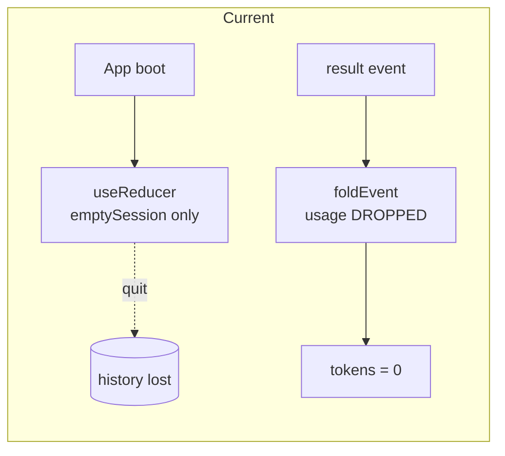
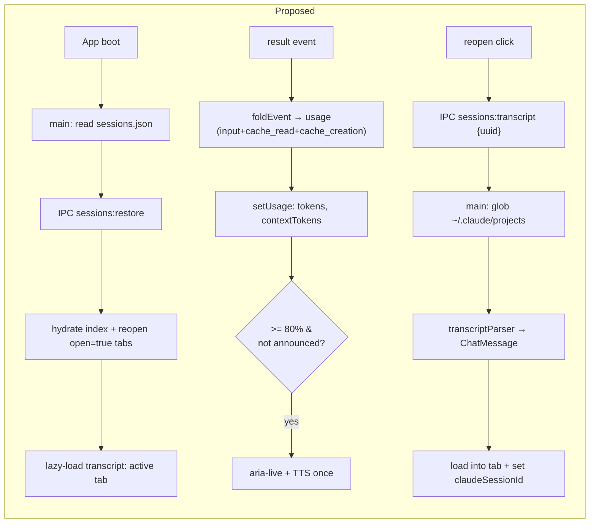

# Plan: Session & Context Persistence (ClaudeDeck)

> Single source of truth for this feature. Design was brainstormed + approved in chat
> (skip separate spec). Accessibility-first Electron app wrapping the `claude` CLI.

## Goal

1. **Sessions survive restart** — reopen the app, your tabs and history come back; `--resume` actually works.
2. **Working "New session" button** ([TabStrip.tsx:45](../../../src/renderer/layout/TabStrip.tsx)) + tab close.
3. **Browse past sessions** in the existing sidebar ([SessionsPanel.tsx](../../../src/renderer/views/sessions/SessionsPanel.tsx)) → click to reopen with full history.
4. **Live context awareness** — capture real token usage; announce **once at 80%** via the existing aria-live + TTS path (critical for blind users).

**Hybrid storage:** we persist only a lightweight *index* (metadata) ourselves; the full conversation already lives in claude's own JSONL transcripts — we read them, never duplicate them.

## Architecture

```
Current (in-memory, ephemeral)                Proposed (hybrid persistence)
──────────────────────────────                ─────────────────────────────
App boot → useReducer([emptySession])         App boot → main reads sessions.json
  └ everything lost on quit                      → IPC sessions:restore → hydrate index
                                                 → lazy-load transcript for active tab only
result event → foldEvent DROPS usage          result event → usage captured (incl. cache_read)
  └ session.tokens always 0                      → setUsage → tokens + contextTokens + 80% announce
"+" button → no handler                       "+" → createSession action
SessionsPanel → live tabs only                SessionsPanel → all index sessions, click reopens
```





## Tech Stack

TypeScript · React · Electron. Main process: `electron/*.ts`. Renderer: `src/renderer/*`.
Tests: **vitest** (existing pattern: `src/renderer/settings/prewarmPhrases.test.ts`). FS owned by main; renderer reaches it via `window.claudedeck.sessions` (contextBridge). Immutable reducer pattern preserved.

## File Structure

```
electron/
  sessionStore.ts          NEW  index load/save/backup + transcript glob/read (main process)
  sessionStore.test.ts     NEW  round-trip, corrupt recovery, glob-by-uuid
  main.ts                  EDIT register sessions:* IPC inside registerIpc()
  preload.ts               EDIT expose window.claudedeck.sessions
src/renderer/
  cli/types.ts             EDIT extend ResultEvent.usage (+cache tokens); add SessionMeta + StoredSession types
  cli/streamMapper.ts      EDIT foldEvent 'result' returns usage
  cli/transcriptParser.ts        NEW  JSONL string → ChatMessage[] (pure)
  cli/transcriptParser.test.ts   NEW  fixtures: string/array content, thinking, tool_use, noise, corrupt
  state/useSessions.ts     EDIT new actions: createSession, closeSession, hydrate, setTitle, setUsage, loadMessages
  state/sessionsClient.ts        NEW  renderer wrapper over window.claudedeck.sessions
  settings/contextWindow.ts      NEW  model→window map, computeContext(), crossed80()
  settings/contextWindow.test.ts NEW  pct math + threshold-cross (fires once, resets after drop)
  mock/fixtures.ts         EDIT Session: add contextTokens?, contextAnnounced?, createdAt?, open?
  App.tsx                  EDIT boot restore, createSession/closeSession wiring, setUsage dispatch, 80% announce, persist
  layout/TabStrip.tsx      EDIT onNew + onClose handlers + a11y labels
  layout/StatusBar.tsx     EDIT show context % chip
  views/sessions/SessionsPanel.tsx  EDIT listbox a11y + reopen (already lists from `sessions` prop)
```

---

## Parallelization Analysis

**File-overlap rule:** `types.ts` is touched by both Task 1 and Task 5 → fold **all** `types.ts`
edits (incl. `StoredSession`) into **Task 1** so Task 5 never edits it. With that, batches:

| Batch | Tasks (disjoint files) | Depends on |
|-------|------------------------|-----------|
| **1** | T1 (types+streamMapper) · T4 (electron/sessionStore) · T3 (transcriptParser) · T9 (SessionsPanel a11y) | — |
| **2** | T2 (contextWindow) · T5 (main+preload+sessionsClient) | T1; T4 |
| **3** | T6 (fixtures+useSessions) | T1, T2 |
| **4** | T8 (TabStrip+StatusBar) | T6, T2 |
| **5** | T7 (App.tsx — integration hub) | T2,T3,T5,T6,T8 |

**Critical path (longest chain):** T1 → T2 → T6 → T8 → T7 (5 sequential). T3, T4, T9 are
"free" — they finish during Batch 1 and never block. Run each batch concurrently; an
aggregating reviewer runs `vitest` after each batch and only advances when green.

---

## Task 1 — Extend usage types + capture in foldEvent (renderer, pure)

> Includes the `StoredSession` interface for `src/renderer/cli/types.ts` (moved here from Task 5
> so `types.ts` has a single editor — see Parallelization Analysis).

**RED:** add to `src/renderer/cli/streamMapper.test.ts` (create if absent):
```ts
import { describe, it, expect } from 'vitest'
import { foldEvent, emptyAssistantMessage } from './streamMapper'

describe('foldEvent result usage', () => {
  it('returns usage with cache tokens on result', () => {
    const msg = emptyAssistantMessage('a1', '2026-01-01T00:00:00Z')
    const r = foldEvent(msg, {
      type: 'result', session_id: 's', is_error: false,
      usage: { input_tokens: 2, output_tokens: 684, cache_read_input_tokens: 102703, cache_creation_input_tokens: 742 },
    } as never)
    expect(r.finalized).toBe(true)
    expect(r.usage).toEqual({ input: 2, output: 684, cacheRead: 102703, cacheCreation: 742 })
  })
})
```

**GREEN — edit `src/renderer/cli/types.ts`** `ResultEvent.usage`:
```ts
export interface ResultEvent {
  type: 'result'
  subtype?: string
  session_id?: string
  is_error?: boolean
  result?: string
  total_cost_usd?: number
  usage?: {
    input_tokens?: number
    output_tokens?: number
    /** Cache tokens still occupy the context window — required for an accurate context %. */
    cache_read_input_tokens?: number
    cache_creation_input_tokens?: number
  }
}

/** Normalised token usage surfaced from a result event. */
export interface TurnUsage {
  input: number
  output: number
  cacheRead: number
  cacheCreation: number
}

/** Renderer mirror of electron/sessionStore.ts StoredSession — keep the two in sync. */
export interface StoredSession {
  id: string; claudeSessionId?: string; cwd: string; title: string; model: string
  tokens: number; contextTokens: number; updatedAt: string; createdAt: string; open: boolean
}
```

**Edit `src/renderer/cli/streamMapper.ts`** — add `usage?: TurnUsage` to `FoldResult`, and the `result` case:
```ts
import type { ClaudeEvent, ContentBlock, ToolResultContent, TurnUsage } from './types'

export interface FoldResult {
  message: ChatMessage
  sessionId?: string
  finalized?: boolean
  errored?: boolean
  usage?: TurnUsage
}

// ...in foldEvent, replace the 'result' case:
    case 'result': {
      const u = event.usage ?? {}
      const usage: TurnUsage = {
        input: u.input_tokens ?? 0,
        output: u.output_tokens ?? 0,
        cacheRead: u.cache_read_input_tokens ?? 0,
        cacheCreation: u.cache_creation_input_tokens ?? 0,
      }
      return { message: { ...message, streaming: false }, sessionId: event.session_id, finalized: true, errored: !!event.is_error, usage }
    }
```

- [ ] Tests pass; `foldEvent` exposes normalised `usage`.

---

## Task 2 — contextWindow.ts: context math + threshold (renderer, pure)

**RED — `src/renderer/settings/contextWindow.test.ts`:**
```ts
import { describe, it, expect } from 'vitest'
import { contextTokensOf, contextPct, crossed80 } from './contextWindow'
import type { TurnUsage } from '@/cli/types'

const u = (o: Partial<TurnUsage>): TurnUsage => ({ input: 0, output: 0, cacheRead: 0, cacheCreation: 0, ...o })

describe('contextWindow', () => {
  it('sums input + cacheRead + cacheCreation (NOT input alone)', () => {
    expect(contextTokensOf(u({ input: 2, cacheRead: 102703, cacheCreation: 742 }))).toBe(103447)
  })
  it('pct against the model window', () => {
    expect(contextPct(100000, 'opus-4-8')).toBeCloseTo(0.5, 5) // 200k window
  })
  it('crossed80 fires only on the upward crossing', () => {
    expect(crossed80(0.79, 0.81)).toBe(true)
    expect(crossed80(0.81, 0.85)).toBe(false) // already above
    expect(crossed80(0.85, 0.40)).toBe(false) // dropped, no fire
  })
  it('drop below 80 resets so a later re-cross fires again', () => {
    expect(crossed80(0.40, 0.81)).toBe(true)
  })
})
```

**GREEN — `src/renderer/settings/contextWindow.ts`:**
```ts
import type { TurnUsage } from '@/cli/types'

/** Effective context window per model id (ClaudeDeck picker ids). Default 200k. */
const CONTEXT_WINDOW: Record<string, number> = {
  'opus-4-8': 200_000,
  'sonnet-4-6': 200_000,
  'haiku-4-5': 200_000,
}
export const DEFAULT_WINDOW = 200_000
export const CONTEXT_THRESHOLD = 0.8

/** Real context occupancy: cache tokens count too (verified against claude JSONL). */
export function contextTokensOf(u: TurnUsage): number {
  return u.input + u.cacheRead + u.cacheCreation
}

export function windowFor(model: string): number {
  return CONTEXT_WINDOW[model] ?? DEFAULT_WINDOW
}

export function contextPct(contextTokens: number, model: string): number {
  return contextTokens / windowFor(model)
}

/** True only on an upward crossing of the 80% line (prev below, next at/above). */
export function crossed80(prevPct: number, nextPct: number): boolean {
  return prevPct < CONTEXT_THRESHOLD && nextPct >= CONTEXT_THRESHOLD
}
```

- [ ] Tests pass.

---

## Task 3 — transcriptParser.ts: claude JSONL → ChatMessage[] (renderer, pure)

Reuses the same block→part shapes as `streamMapper`. Filters noise types
(`queue-operation`, `attachment`, `last-prompt`, `system`). Handles string OR array content. Never throws.

**RED — `src/renderer/cli/transcriptParser.test.ts`:**
```ts
import { describe, it, expect } from 'vitest'
import { parseTranscript } from './transcriptParser'

const line = (o: unknown) => JSON.stringify(o)

describe('parseTranscript', () => {
  it('skips noise + corrupt lines, keeps user(string) and assistant(blocks)', () => {
    const jsonl = [
      line({ type: 'queue-operation', operation: 'enqueue' }),
      line({ type: 'attachment' }),
      '{ this is corrupt',
      line({ type: 'user', message: { role: 'user', content: 'hello' } }),
      line({ type: 'assistant', message: { role: 'assistant', content: [
        { type: 'thinking', thinking: 'hmm' },
        { type: 'text', text: 'hi there' },
        { type: 'tool_use', id: 't1', name: 'Read', input: { file_path: '/a.ts' } },
      ] } }),
      line({ type: 'user', message: { role: 'user', content: [
        { type: 'tool_result', tool_use_id: 't1', content: 'file body', is_error: false },
      ] } }),
    ].join('\n')

    const msgs = parseTranscript(jsonl)
    expect(msgs.map((m) => m.role)).toEqual(['user', 'assistant'])
    const u = msgs[0]; const a = msgs[1]
    expect(u.parts).toEqual([{ kind: 'markdown', text: 'hello' }])
    expect(a.parts.map((p) => p.kind)).toEqual(['thinking', 'markdown', 'tool'])
    const tool = a.parts.find((p) => p.kind === 'tool') as { call: { status: string; output?: string } }
    expect(tool.call.status).toBe('done')          // tool_result folded in
    expect(tool.call.output).toBe('file body')
    expect(a.streaming).toBeFalsy()
  })

  it('returns [] for empty / all-noise input (never throws)', () => {
    expect(parseTranscript('')).toEqual([])
    expect(parseTranscript('not json\n{"type":"system"}')).toEqual([])
  })
})
```

**GREEN — `src/renderer/cli/transcriptParser.ts`:**
```ts
import type { ChatMessage, MessagePart, ToolCall } from '@/mock/fixtures'
import type { ContentBlock, ToolResultBlock, ToolResultContent } from './types'

const NOISE = new Set(['queue-operation', 'attachment', 'last-prompt', 'system'])

function toolLabel(name: string, input: unknown): string {
  const o = (input ?? {}) as Record<string, unknown>
  for (const k of ['file_path', 'path', 'pattern', 'command', 'url', 'query'] as const) {
    if (typeof o[k] === 'string' && o[k]) return o[k] as string
  }
  return name
}
function blockToPart(block: ContentBlock): MessagePart | null {
  switch (block.type) {
    case 'text': return { kind: 'markdown', text: block.text }
    case 'thinking': return { kind: 'thinking', text: block.thinking }
    case 'tool_use':
      return { kind: 'tool', call: { id: block.id, tool: block.name, label: toolLabel(block.name, block.input), status: 'done', input: block.input } }
    default: return null
  }
}
function resultText(content: ToolResultContent): string {
  if (typeof content === 'string') return content
  if (Array.isArray(content)) {
    return content.map((c) => (c.type === 'text' && typeof (c as { text?: string }).text === 'string' ? (c as { text: string }).text : '')).filter(Boolean).join('\n')
  }
  return ''
}

/** Apply historical tool_result blocks onto the most recent assistant tool parts. */
function applyToolResults(messages: ChatMessage[], results: ToolResultBlock[]): void {
  for (let i = messages.length - 1; i >= 0; i--) {
    const m = messages[i]
    if (m.role !== 'assistant') continue
    m.parts = m.parts.map((p): MessagePart => {
      if (p.kind !== 'tool') return p
      const res = results.find((r) => r.tool_use_id === p.call.id)
      if (!res) return p
      const call: ToolCall = { ...p.call, status: res.is_error ? 'error' : 'done', output: resultText(res.content) }
      return { kind: 'tool', call }
    })
    break
  }
}

export function parseTranscript(jsonl: string): ChatMessage[] {
  const out: ChatMessage[] = []
  let n = 0
  for (const raw of jsonl.split(/\r?\n/)) {
    const line = raw.trim()
    if (!line) continue
    let o: { type?: string; message?: { role?: string; content?: unknown } }
    try { o = JSON.parse(line) } catch { continue }
    if (!o.type || NOISE.has(o.type)) continue
    const content = o.message?.content
    if (o.type === 'user') {
      if (typeof content === 'string') {
        out.push({ id: `h-${n++}`, role: 'user', createdAt: '', parts: [{ kind: 'markdown', text: content }] })
      } else if (Array.isArray(content)) {
        const results = content.filter((c): c is ToolResultBlock => !!c && (c as { type?: string }).type === 'tool_result')
        if (results.length) applyToolResults(out, results)
      }
    } else if (o.type === 'assistant' && Array.isArray(content)) {
      const parts = content.map((b) => blockToPart(b as ContentBlock)).filter((p): p is MessagePart => p !== null)
      out.push({ id: `h-${n++}`, role: 'assistant', createdAt: '', parts, streaming: false })
    }
  }
  return out
}
```

- [ ] Tests pass. Note: `ToolCall.status` must accept `'done' | 'error' | 'running'` (verify in fixtures).

---

## Task 4 — electron/sessionStore.ts: index + transcript loader (main process)

Index file at `app.getPath('userData')/sessions.json`. Transcript glob over `~/.claude/projects/*/<uuid>.jsonl` (UUID is unique → no fragile cwd encoding). Never throws; corrupt index is backed up then reset.

**RED — `electron/sessionStore.test.ts`** (inject paths so no real FS/home needed):
```ts
import { describe, it, expect, beforeEach } from 'vitest'
import { mkdtempSync, writeFileSync, existsSync, rmSync, mkdirSync } from 'node:fs'
import { tmpdir } from 'node:os'
import { join } from 'node:path'
import { loadIndex, saveIndex, findTranscript } from './sessionStore'

let dir: string
beforeEach(() => { dir = mkdtempSync(join(tmpdir(), 'cds-')) })

describe('index round-trip', () => {
  it('save then load returns the same sessions', () => {
    const file = join(dir, 'sessions.json')
    const sessions = [{ id: 'a', claudeSessionId: 'uuid', cwd: 'D:/x', title: 'T', model: 'opus-4-8', tokens: 5, contextTokens: 5, updatedAt: 'now', createdAt: 'then', open: true }]
    saveIndex(file, sessions)
    expect(loadIndex(file)).toEqual(sessions)
  })
  it('missing file → []', () => { expect(loadIndex(join(dir, 'none.json'))).toEqual([]) })
  it('corrupt file → backed up + []', () => {
    const file = join(dir, 'sessions.json'); writeFileSync(file, '{bad', 'utf8')
    expect(loadIndex(file)).toEqual([])
    expect(existsSync(file + '.bak')).toBe(true)
  })
})

describe('findTranscript globs by uuid', () => {
  it('finds <uuid>.jsonl one level under projects root', () => {
    const projects = join(dir, 'projects'); mkdirSync(join(projects, 'D--x'), { recursive: true })
    const f = join(projects, 'D--x', 'abc-123.jsonl'); writeFileSync(f, '{"type":"user","message":{"role":"user","content":"hi"}}', 'utf8')
    expect(findTranscript(projects, 'abc-123')).toBe(f)
    expect(findTranscript(projects, 'missing')).toBeNull()
  })
})
```

**GREEN — `electron/sessionStore.ts`:**
```ts
import { readFileSync, writeFileSync, renameSync, existsSync, readdirSync, statSync } from 'node:fs'
import { join } from 'node:path'
import { homedir } from 'node:os'
import { app } from 'electron'
// NOTE (vitest): this is the first runtime `electron`-value import in the codebase.
// Under vitest `app` is `undefined` (electron is externalized). That's fine ONLY because
// every exported fn takes an explicit path arg in tests and never hits the default-arg
// `indexFile()`/`projectsRoot()`. Do NOT add a top-level `app.getPath()` call — it would
// throw under test. Keep all `app` access inside functions, guarded by default args.

// Mirror of the renderer-side StoredSession in src/renderer/cli/types.ts — keep in sync
// (electron and renderer can't share the `@/` alias). Changing one means changing both.
export interface StoredSession {
  id: string
  claudeSessionId?: string
  cwd: string
  title: string
  model: string
  tokens: number
  contextTokens: number
  updatedAt: string
  createdAt: string
  open: boolean
}

/** ~/.claude/projects — where the CLI writes per-session JSONL transcripts. */
export function projectsRoot(): string {
  return join(homedir(), '.claude', 'projects')
}
function indexFile(): string {
  return join(app.getPath('userData'), 'sessions.json')
}

export function loadIndex(file = indexFile()): StoredSession[] {
  if (!existsSync(file)) return []
  try {
    const data = JSON.parse(readFileSync(file, 'utf8'))
    return Array.isArray(data) ? (data as StoredSession[]) : []
  } catch {
    try { renameSync(file, file + '.bak') } catch { /* best-effort */ }
    return []
  }
}

export function saveIndex(file: string | StoredSession[], maybe?: StoredSession[]): void {
  const target = typeof file === 'string' ? file : indexFile()
  const sessions = typeof file === 'string' ? (maybe ?? []) : file
  try { writeFileSync(target, JSON.stringify(sessions, null, 2), 'utf8') } catch { /* never throw on quit */ }
}

/** Locate <uuid>.jsonl one level under the projects root. Returns abs path or null. */
export function findTranscript(root: string, uuid: string): string | null {
  if (!existsSync(root)) return null
  let dirs: string[]
  try { dirs = readdirSync(root) } catch { return null }
  for (const d of dirs) {
    const p = join(root, d)
    try { if (!statSync(p).isDirectory()) continue } catch { continue }
    const f = join(p, `${uuid}.jsonl`)
    if (existsSync(f)) return f
  }
  return null
}

/** Read a transcript by claude session uuid. null when absent/unreadable. */
export function readTranscript(uuid: string): string | null {
  const f = findTranscript(projectsRoot(), uuid)
  if (!f) return null
  try { return readFileSync(f, 'utf8') } catch { return null }
}
```

- [ ] Tests pass (round-trip, corrupt→backup, glob hit/miss).

---

## Task 5 — IPC wiring: main.ts + preload.ts + sessionsClient.ts

**Edit `electron/main.ts`** — import and register inside `registerIpc()` (near the `git:*` handlers ~line 420):
```ts
import { loadIndex, saveIndex, readTranscript, type StoredSession } from './sessionStore'
// ...inside registerIpc():
  ipcMain.handle('sessions:load', () => loadIndex())
  ipcMain.handle('sessions:save', (_e, sessions: StoredSession[]) => { saveIndex(sessions); return { ok: true } })
  ipcMain.handle('sessions:transcript', (_e, uuid: string) => readTranscript(uuid))
```

**Edit `electron/preload.ts`** — add to `api` (after `claude`):
```ts
  /** Hybrid session persistence: our metadata index + claude's JSONL transcripts. */
  sessions: {
    load: (): Promise<import('./sessionStore').StoredSession[]> => ipcRenderer.invoke('sessions:load'),
    save: (sessions: import('./sessionStore').StoredSession[]): Promise<{ ok: boolean }> =>
      ipcRenderer.invoke('sessions:save', sessions),
    transcript: (uuid: string): Promise<string | null> => ipcRenderer.invoke('sessions:transcript', uuid),
  },
```

**NEW `src/renderer/state/sessionsClient.ts`:**
```ts
import type { StoredSession } from '@/cli/types'

function bridge() {
  return typeof window !== 'undefined' ? (window as { claudedeck?: { sessions?: {
    load: () => Promise<StoredSession[]>
    save: (s: StoredSession[]) => Promise<{ ok: boolean }>
    transcript: (uuid: string) => Promise<string | null>
  } } }).claudedeck?.sessions : undefined
}

export async function loadIndex(): Promise<StoredSession[]> { return (await bridge()?.load()) ?? [] }
export async function saveIndex(sessions: StoredSession[]): Promise<void> { await bridge()?.save(sessions) }
export async function loadTranscript(uuid: string): Promise<string | null> { return (await bridge()?.transcript(uuid)) ?? null }
```

> `StoredSession` in `src/renderer/cli/types.ts` is added in **Task 1** (single editor for types.ts).
> Task 5 only *imports* it — it does not edit types.ts.

- [ ] `window.claudedeck.sessions` reachable from the renderer; types compile.

---

## Task 6 — fixtures.ts + reducer: persistence-aware session state

**Edit `src/renderer/mock/fixtures.ts`** `Session` — add optional fields (keep existing):
```ts
  /** Current context-window occupancy in tokens (input + cache). */
  contextTokens?: number
  /** True once the 80% context warning has been announced (reset when it drops). */
  contextAnnounced?: boolean
  /** ISO creation time (for the session list). */
  createdAt?: string
  /** Whether this session is an open tab (restored on boot). */
  open?: boolean
```

**Edit `src/renderer/state/useSessions.ts`** — new actions + helpers. RED first in `useSessions.test.ts`:
```ts
import { describe, it, expect } from 'vitest'
import { sessionsReducer, emptySession, toStored, fromStored } from './useSessions'

describe('session lifecycle', () => {
  it('createSession appends + marks open', () => {
    const s0 = { sessions: [emptySession('a')] }
    const s1 = sessionsReducer(s0, { type: 'createSession', session: emptySession('b') })
    expect(s1.sessions.map((s) => s.id)).toEqual(['a', 'b'])
  })
  it('closeSession removes by id', () => {
    const s0 = { sessions: [emptySession('a'), emptySession('b')] }
    expect(sessionsReducer(s0, { type: 'closeSession', sessionId: 'a' }).sessions.map((s) => s.id)).toEqual(['b'])
  })
  it('hydrate replaces sessions from stored', () => {
    const stored = [{ id: 'x', cwd: 'D:/p', title: 'Old', model: 'opus-4-8', tokens: 9, contextTokens: 9, updatedAt: 'u', createdAt: 'c', open: true, claudeSessionId: 'uuid' }]
    const s1 = sessionsReducer({ sessions: [] }, { type: 'hydrate', stored })
    expect(s1.sessions[0]).toMatchObject({ id: 'x', title: 'Old', tokens: 9, claudeSessionId: 'uuid', messages: [] })
  })
  it('setUsage updates tokens + contextTokens', () => {
    const s0 = { sessions: [emptySession('a')] }
    const s1 = sessionsReducer(s0, { type: 'setUsage', sessionId: 'a', usage: { input: 2, output: 10, cacheRead: 100, cacheCreation: 0 } })
    expect(s1.sessions[0].contextTokens).toBe(102)
    expect(s1.sessions[0].tokens).toBe(10) // cumulative output
  })
  it('toStored/fromStored round-trip drops messages', () => {
    const s = { ...emptySession('a'), claudeSessionId: 'uuid', tokens: 3, contextTokens: 3, createdAt: 'c', open: true }
    expect(fromStored(toStored(s))).toMatchObject({ id: 'a', tokens: 3, messages: [], claudeSessionId: 'uuid' })
  })
})
```

GREEN — extend the reducer (keep `patchSession` immutability):
```ts
import type { StoredSession, TurnUsage } from '@/cli/types'
import { contextTokensOf } from '@/settings/contextWindow'

export type SessionsAction =
  | { type: 'startTurn'; sessionId: string; userMessage: ChatMessage; assistantMessage: ChatMessage }
  | { type: 'event'; sessionId: string; event: ClaudeEvent }
  | { type: 'terminal'; sessionId: string; line: TerminalLine }
  | { type: 'finishTurn'; sessionId: string }
  | { type: 'setCwd'; sessionId: string; cwd: string }
  | { type: 'createSession'; session: Session }
  | { type: 'closeSession'; sessionId: string }
  | { type: 'hydrate'; stored: StoredSession[] }
  | { type: 'setTitle'; sessionId: string; title: string }
  | { type: 'setUsage'; sessionId: string; usage: TurnUsage }
  | { type: 'loadMessages'; sessionId: string; messages: ChatMessage[]; claudeSessionId?: string }

// emptySession: add createdAt + open
export function emptySession(id: string): Session {
  const now = new Date().toISOString()
  return { id, title: 'New session', cwd: '', status: 'idle', model: 'opus-4-8', updatedAt: now, createdAt: now, open: true, tokens: 0, contextTokens: 0, messages: [], terminalLines: [] }
}

export function toStored(s: Session): StoredSession {
  return { id: s.id, claudeSessionId: s.claudeSessionId, cwd: s.cwd, title: s.title, model: s.model, tokens: s.tokens, contextTokens: s.contextTokens ?? 0, updatedAt: s.updatedAt, createdAt: s.createdAt ?? s.updatedAt, open: s.open ?? true }
}
export function fromStored(s: StoredSession): Session {
  return { id: s.id, claudeSessionId: s.claudeSessionId, cwd: s.cwd, title: s.title, status: 'idle', model: s.model, tokens: s.tokens, contextTokens: s.contextTokens, updatedAt: s.updatedAt, createdAt: s.createdAt, open: s.open, messages: [], terminalLines: [] }
}

// new cases in sessionsReducer:
    case 'createSession':
      return { sessions: [...state.sessions, action.session] }
    case 'closeSession':
      return { sessions: state.sessions.filter((s) => s.id !== action.sessionId) }
    case 'hydrate':
      return { sessions: action.stored.map(fromStored) }
    case 'setTitle':
      return patchSession(state, action.sessionId, (s) => ({ ...s, title: action.title, updatedAt: new Date().toISOString() }))
    case 'loadMessages':
      return patchSession(state, action.sessionId, (s) => ({ ...s, messages: action.messages, claudeSessionId: action.claudeSessionId ?? s.claudeSessionId }))
    case 'setUsage':
      return patchSession(state, action.sessionId, (s) => ({
        ...s,
        tokens: s.tokens + action.usage.output,
        contextTokens: contextTokensOf(action.usage),
        updatedAt: new Date().toISOString(),
      }))
```

> `setUsage` sets `contextTokens` to the latest turn's occupancy (not cumulative) — context is a point-in-time measure that resets after `/compact`. `tokens` stays cumulative-output for the existing "tok" display. The 80%-announce + `contextAnnounced` flag flip lives in App.tsx (Task 7) where TTS is available; the reducer stays pure.

- [ ] Reducer tests pass.

---

## Task 7 — App.tsx: boot restore, lifecycle wiring, usage + 80% announce, persistence

All edits in `src/renderer/App.tsx`.

**(a) imports:** also add `emptySession` to the existing `useSessions` import (line 33 currently imports only `useSessions`):
```ts
import { useSessions, emptySession } from '@/state/useSessions'   // was: import { useSessions }
import * as sessionsClient from '@/state/sessionsClient'
import { contextPct, crossed80 } from '@/settings/contextWindow'
import { toStored } from '@/state/useSessions'
```

**(b) boot restore** (after `useSessions()`), and a "hydrated" guard so we don't persist before the first load:
```ts
  const hydratedRef = useRef(false)
  useEffect(() => {
    void sessionsClient.loadIndex().then(async (stored) => {
      if (stored.length) {
        sessionsDispatch({ type: 'hydrate', stored })
        const active = stored.find((s) => s.open) ?? stored[0]
        setActiveSessionId(active.id)
        if (active.claudeSessionId) {
          const jsonl = await sessionsClient.loadTranscript(active.claudeSessionId)
          if (jsonl) {
            const { parseTranscript } = await import('@/cli/transcriptParser')
            sessionsDispatch({ type: 'loadMessages', sessionId: active.id, messages: parseTranscript(jsonl), claudeSessionId: active.claudeSessionId })
          }
        }
      } else {
        // Fresh install (empty index): the boot session is emptySession('main'),
        // but activeSessionId defaults to ACTIVE_SESSION_ID ('s1') which has no
        // matching session. Without this, no tab renders active. (Reviewer-flagged.)
        setActiveSessionId(sessions[0].id)
      }
      hydratedRef.current = true
    })
    // eslint-disable-next-line react-hooks/exhaustive-deps
  }, [])
```

**(c) debounced persistence** whenever sessions change post-hydration:
```ts
  useEffect(() => {
    if (!hydratedRef.current) return
    const t = setTimeout(() => { void sessionsClient.saveIndex(sessions.map(toStored)) }, 400)
    return () => clearTimeout(t)
  }, [sessions])

  // Quit-flush: the 400ms debounce can drop the final change if the app closes
  // right after it. Flush un-debounced on unload. (Reviewer-flagged.) Keep a ref
  // so the listener always sees the latest sessions without re-binding each render.
  const sessionsRef = useRef(sessions)
  sessionsRef.current = sessions
  useEffect(() => {
    const flush = (): void => { if (hydratedRef.current) void sessionsClient.saveIndex(sessionsRef.current.map(toStored)) }
    window.addEventListener('beforeunload', flush)
    return () => window.removeEventListener('beforeunload', flush)
  }, [])
```

**(d) New / close / reopen handlers:**
```ts
  const newSession = (): void => {
    const id = nextId('s')
    sessionsDispatch({ type: 'createSession', session: emptySession(id) })
    setActiveSessionId(id)
    speakStatus(say({ th: 'เปิดเซสชันใหม่', en: 'New session' }))
  }
  const closeSessionTab = (id: string): void => {
    if (sessions.length <= 1) return // keep at least one
    const idx = sessions.findIndex((s) => s.id === id)
    sessionsDispatch({ type: 'closeSession', sessionId: id })
    if (id === activeSessionId) {
      const fallback = sessions[idx + 1] ?? sessions[idx - 1]
      if (fallback) setActiveSessionId(fallback.id)
    }
  }
  const reopenSession = async (id: string): Promise<void> => {
    setActiveSessionId(id)
    setActivity('chat')
    const s = sessions.find((x) => x.id === id)
    if (s && s.messages.length === 0 && s.claudeSessionId) {
      const jsonl = await sessionsClient.loadTranscript(s.claudeSessionId)
      if (jsonl) {
        const { parseTranscript } = await import('@/cli/transcriptParser')
        sessionsDispatch({ type: 'loadMessages', sessionId: id, messages: parseTranscript(jsonl), claudeSessionId: s.claudeSessionId })
      } else {
        speakStatus(say({ th: 'ประวัติโหลดไม่ได้ แต่คุยต่อได้', en: 'History unavailable; you can still continue' }))
      }
    }
  }
```
> `emptySession` is already imported indirectly; import it explicitly: `import { useSessions, emptySession } from '@/state/useSessions'` and call `emptySession(id)` (drop the `emptySessionImport` alias above — use `emptySession`).

**(e) capture usage + 80% announce** inside the existing `onEvent` handler in `handleSend`, right after `sessionsDispatch({ type: 'event', ... })`:
```ts
        if (event.type === 'result') {
          const u = (event as { usage?: import('@/cli/types').ResultEvent['usage'] }).usage
          const usage = {
            input: u?.input_tokens ?? 0, output: u?.output_tokens ?? 0,
            cacheRead: u?.cache_read_input_tokens ?? 0, cacheCreation: u?.cache_creation_input_tokens ?? 0,
          }
          const prev = sessionsRef.current.find((s) => s.id === sid) // sessionsRef from 7c avoids stale-closure
          const prevPct = contextPct(prev?.contextTokens ?? 0, prev?.model ?? 'opus-4-8')
          const nextCtx = usage.input + usage.cacheRead + usage.cacheCreation
          const nextPct = contextPct(nextCtx, prev?.model ?? 'opus-4-8')
          sessionsDispatch({ type: 'setUsage', sessionId: sid, usage })
          if (crossed80(prevPct, nextPct)) {
            speakStatus(say({ th: `ใช้ context ${Math.round(nextPct * 100)} เปอร์เซ็นต์แล้ว`, en: `Context at ${Math.round(nextPct * 100)} percent` }))
          }
        }
```
> Stale-closure is real (`handleSend` closes over `sessions`). Reuse the `sessionsRef` introduced in **7c** (`sessionsRef.current = sessions` each render) — already in scope, no second ref needed.

**(f) pass handlers down:**
```tsx
        <TabStrip sessions={sessions} activeSessionId={activeSessionId} onSelect={setActiveSessionId}
          onNew={newSession} onClose={closeSessionTab} />
// Sidebar/SessionsPanel reopen: route onSelectSession through reopenSession for the sessions view.
        <Sidebar activity={activity} sessions={sessions} activeSessionId={activeSessionId}
          onSelectSession={(id) => void reopenSession(id)} />
```

- [ ] Manual: quit + relaunch restores tabs; reopening an old session shows history; 80% spoken once.

---

## Task 8 — TabStrip + StatusBar UI

**Edit `src/renderer/layout/TabStrip.tsx`** — add `onNew` + `onClose` props; wire the `+` button and per-tab `X`; a11y labels:
```tsx
interface TabStripProps {
  sessions: Session[]; activeSessionId: string; onSelect: (id: string) => void
  onNew: () => void; onClose: (id: string) => void
}
// X button (inside the tab button is invalid — nest as a sibling span with role=button, or move X out of the <button>):
//   render the tab as a <div role="tab"> wrapper containing a select <button> + a close <button>,
//   to avoid a button-inside-button. The outer div MUST keep the `group relative` classes:
//   `relative` so the active-underline <span> (absolute) anchors to the tab (it's currently
//   anchored wrong — pre-existing latent bug), and `group` so the X keeps its `group-hover:opacity-60`.
        <button type="button" aria-label={`Close ${s.title}`} onClick={(e) => { e.stopPropagation(); onClose(s.id) }} ...><X size={13} /></button>
// + button:
      <button type="button" title="New session" aria-label="New session" onClick={onNew} ...><Plus size={16} /></button>
```

**Edit `src/renderer/layout/StatusBar.tsx`** — add a context chip next to the tokens chip:
```tsx
import { windowFor } from '@/settings/contextWindow'
// ...inside the right cluster, after the tokens span:
        {typeof session.contextTokens === 'number' && session.contextTokens > 0 && (
          <span className="flex items-center gap-1.5 font-mono" title="Context window used">
            {Math.round((session.contextTokens / windowFor(session.model)) * 100)}% ctx
          </span>
        )}
```

- [ ] `+` creates a tab; `X` closes; context % shows after a turn.

---

## Task 9 — SessionsPanel a11y (reopen + listbox semantics)

`SessionsPanel` already renders from the `sessions` prop and calls `onSelect` — App now routes `onSelect` through `reopenSession`, so reopening works without changes here. Add accessibility (blind = first-class user):

**Edit `src/renderer/views/sessions/SessionsPanel.tsx`:**
```tsx
    <ul role="listbox" aria-label="Sessions" className="space-y-1 px-2 py-1">
// each item:
      <li key={session.id} role="option" aria-selected={isActive}>
        <button ... aria-label={`${session.title}, ${formatCwdBasename(session.cwd)}, ${session.model}, ${getRelativeTime(session.updatedAt)}`}>
```

- [ ] Screen reader announces each session; Enter/click reopens with history.

---

## Manual verification checklist

- [ ] `npm run build` / typecheck clean; `vitest` green.
- [ ] Run app, send a turn, quit, relaunch → tab + history restored, `--resume` continues the same claude session.
- [ ] `+` opens a fresh session; `X` closes (never below 1).
- [ ] Open a second session, switch back in SessionsPanel → its history loads.
- [ ] Drive context past 80% (long session) → spoken once; not repeated next turn; after `/compact` it can fire again.
- [ ] Corrupt `sessions.json` manually → app still boots (file moved to `.bak`).

## YAGNI (explicitly out)
Cross-device sync · in-transcript search · multi-window · scanning ALL `~/.claude/projects` for externally-created CLI sessions (follow-up).
